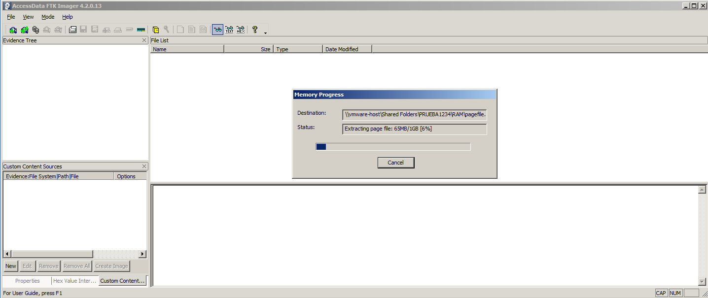
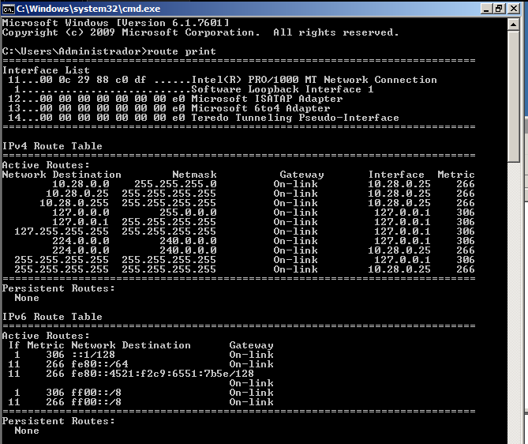
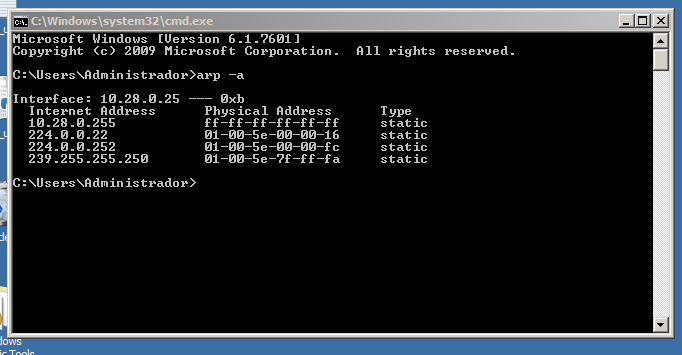
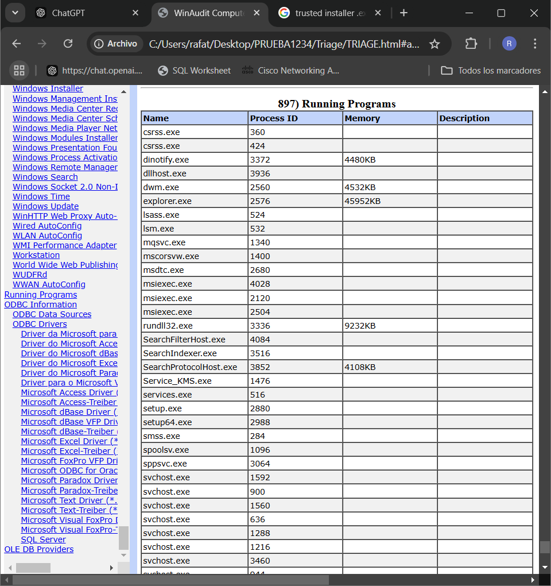
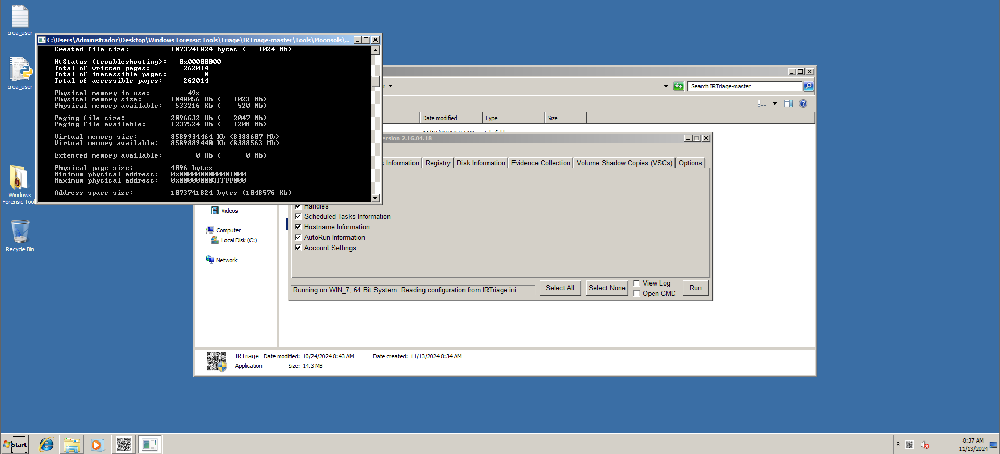
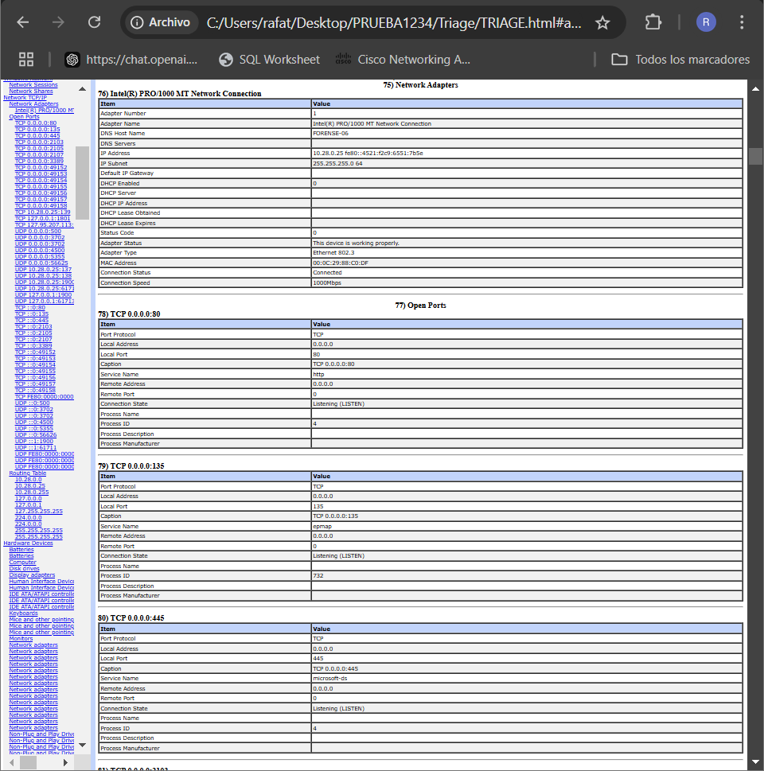
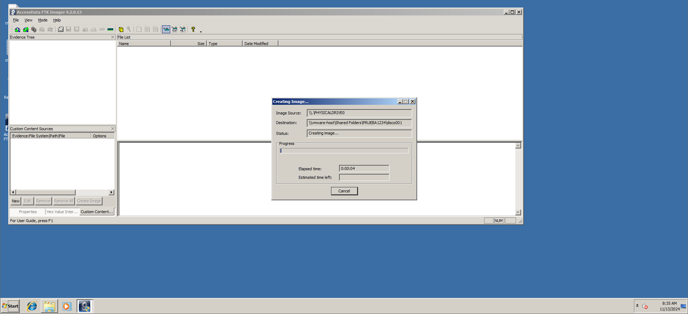

# Incident investigation

## Introducción

Este informe presenta un análisis detallado de la adquisición forense realizada sobre una máquina virtual comprometida, simulando un incidente de ciberseguridad. El objetivo de este ejercicio es documentar paso a paso el proceso de recolección y almacenamiento de evidencia digital, aplicando las mejores prácticas en investigación forense y asegurando la integridad de las evidencias recolectadas. 

A continuación, se detallan las fases de recolección y almacenamiento de evidencia, junto con el análisis técnico de los hallazgos derivados del proceso.

## Recolección y almacenamiento de evidencias

La recolección de evidencia digital en un entorno de máquina virtual comprometida se ha realizado según la metodología estándar de nuestra empresa, que asegura la integridad y validez de la información capturada. 

Contamos con la autorización previa de los responsables para acceder y manipular la máquina virtual.

Para dar inicio al proceso de adquisición forense, se procedió a la documentación exhaustiva de los detalles básicos y la configuración de la máquina virtual comprometida.

__Registro de fecha y hora__

Fecha de documentación inicial: 12/11/2024
Hora de documentación inicial: 12:19

Este registro se realizó siguiendo la normativa de sincronización de tiempo para garantizar la precisión en el cronograma del incidente.

__Ubicación de la máquina virtual en elentorno virtual__

Entorno virtual: VMware.

Ubicación de la Máquina Virtual: La máquina en cuestión está virtualizada en mi dispositivo personal.

__Propiedades y configuración de la máquina virtual__

A continuación, se documentan las propiedades esenciales de la VM comprometida, lo cual será útil para comprender sus características operativas y el contexto de la intrusión.

Nombre de la Máquina Virtual: FORENSIC_10
Sistema Operativo: Windows 7 Professional
Dirección IP Asignada: 10.28.0.25
Configuración de Red: 255.255.255.0

Recursos Asignados:
Procesador: 1 núcleo
Memoria RAM: 2Gb
Almacenamiento: 32Gb

## Identificación y clasificación de evidencias

Para realizar una adquisición forense adecuada de la máquina virtual comprometida, se han identificado y clasificado las evidencias digitales siguiendo la jerarquía de volatilidad. Esto permite recolectar primero los datos más volátiles, asegurando su preservación antes de que puedan ser alterados o eliminados.

### Memoria volátil

Para empezar capturaremos la memoria RAM con la herramienta FTK Imager, volcaremos la memoria RAM al completo.

Captura de cachés específicos:

__Tabla de enrutamiento__

Para identificar la tabla de enrutamiento hemos emitido el comando route print y lo hemos almacenado en un archivo .txt al cual posteriormente se le ha calculado el hash "SHA1 y MD5" para mantener la integridad.

__Caché ARP__

En el caso del caché ARP hemos ejecutado el comando arp -a y este resultado lo hemos almacenado en un archivo .txt al cual posteriormente se le ha calculado el hash "SHA1 y MD5" para mantener la integridad.

### Triage del sistema 

El triage inicial del sistema es una fase crítica en el análisis forense, ya que permite identificar rápidamente los elementos de interés que podrían contener información relevante para el caso antes de realizar una adquisición completa.

Este triage inicial se ha realizado con WinAudit e IRTriage-Master en el cual se realizó un análisis detallado de los procesos activos en el sistema en el momento de la adquisición. Los procesos con nombres inusuales, ubicaciones desconocidas o en rutas sospechosas fueron marcados para un análisis más profundo. 

(WinAudit)

(IRTriage-Master)

También se revisaron las conexiones de red activas para identificar cualquier comunicación externa que pudiera comprometer la integridad del sistema o relacionarse con actividad malintencionada.

La exploración de archivos recientes y modificados fue otra técnica clave en el triage inicial. Se identificaron archivos abiertos recientemente por el usuario o por aplicaciones del sistema en las siguientes ubicaciones:

Documentos de usuario en la carpeta documentos
Archivos de sistema de Windows, la carpeta System32
Directorios temporales y de caché 

### Memoria no volátil

La adquisición de la memoria no volátil en el sistema incluyó la creación de una imagen forense completa del disco duro para asegurar una copia exacta y verificable de todos los datos almacenados. El proceso de creación de esta imagen se realizó utilizando FTK Imager, siguiendo estándares de preservación y custodia de evidencias digitales.

Para la adquisición del disco, se seleccionó el formato de imagen E01.

Se generaron hashes MD5 y SHA-1 tanto al inicio como al final de la adquisición, para verificar la integridad y autenticidad de la imagen forense creada. Estos hashes fueron documentados y posteriormente verificados para asegurar que la imagen es una copia fiel del disco original.

La adquisición se realizó en un entorno controlado, donde el disco duro fue conectado a una estación de trabajo forense utilizando un bloqueador de escritura. 

Al concluir el proceso de adquisición, FTK Imager generó los hashes MD5 y SHA-1 de la imagen final, los cuales fueron comparados con los generados al inicio del proceso para confirmar la integridad de la imagen.

